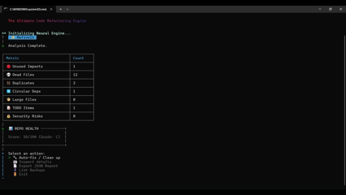
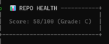
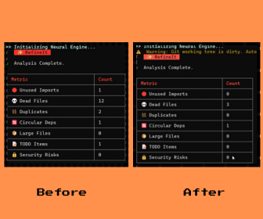

<div align="center">


# **RefineIt — Automated Codebase Refactoring Engine (Safe by Design)**  
### *Clean your repository. Remove dead code. Fix unused imports. Detect risks. Auto-PR your changes — fully automated.*

<br/>

[](https://www.npmjs.com/package/refineit)
[](https://www.npmjs.com/package/refineit)


<br/>

[](https://www.linkedin.com/in/nowrozmd/)
[](mailto:mdnowroz13@gmail.com)

</div>

---

# ❓ What is RefineIt?

**RefineIt is an automated code-refactoring engine designed for modern JavaScript / TypeScript repositories.**

It scans your entire repository, understands how files depend on each other, and then:

- Removes **dead files** (never imported anywhere)
- Cleans **unused imports**
- Detects **circular dependencies**
- Flags **security-sensitive patterns**
- Generates a **repo health score**
- Creates a **backup snapshot** before making any changes
- Supports **UNDO** (you can revert everything)
- And optionally **creates automated Pull Requests** in CI

RefineIt is the kind of tool you wish existed inside `npx`, so we built it.

---

# ⭐ Why RefineIt Exists

Every repo eventually becomes messy:

- Old files nobody uses  
- Helper utilities that were replaced months ago  
- TODOs scattered everywhere  
- Debugging functions left behind in a rush  
- Imports that remained after refactors  
- Risky code paths nobody notices  

Developers *feel* this mess, but don’t have time to fix it.

👉 **RefineIt fixes the repository for you — safely, automatically, and with full reversibility.**

---

# 🚀 Installation

```sh
npm install -g refineit
```
or run without installing:

```sh
npx refineit
```

# 🧠 How RefineIt Works (Real Explanation)
RefineIt doesn’t simply "search files". It performs a full dependency graph analysis.

## 🔍 1. Deep Repo Scan
RefineIt walks through your entire project, following all imports, exports, and usage references.
It builds a dependency graph to understand:

- Which files are actually used
- Which imports are actually referenced
- Which exports nobody touches
- Which files only import things but never get imported
- Which utilities are duplicates
- Where circular references exist

This is why it finds true dead code, not just unused variables.

## ⚙️ 2. Code Intelligence Engine
RefineIt executes a real static analysis engine:

- Parses TypeScript + JavaScript
- Resolves TSConfig paths
- Resolves absolute imports
- Normalizes mixed slash/backslash paths
- Handles monorepo layouts
- Avoids false positives by using cross-file references

## ✨ 3. Applies Fixes (Optional)
If you run:

```sh
npx refineit --apply
```

It will:

- Delete dead files
- Remove unused imports
- Clean unused exports
- Fix duplicated references
- Generate a human-readable report

Before doing ANY changes, it:

## 🛡️ Safety First: The Safety-Lock System
RefineIt refuses to modify your repo if:

- You have uncommitted changes
- Git is not available
- Repository is in a detached HEAD state
- The user didn’t confirm --apply

Example output:

```pgsql
🔒 Safety Lock Engaged — you have uncommitted changes.
Commit or stash before applying fixes.
```
This is intentional.

👉 **Our rule: RefineIt will never modify a repository unless 100% safe.**

Demo:


## 🗃️ Automatic Backup & Undo System
Before RefineIt writes any change, it creates:

```bash
.refineit/archives/backup-YYYY-MM-DD-HH-MM-SS
```
This backup includes:

- Every file before modification
- A manifest.json describing what changed
- The full repo structure snapshot

Undo is simple:

```sh
refineit undo <backup-id>
```
Your entire repo is restored instantly.

Demo:


## 📊 Repo Health Score (Unique Feature)
After scanning, RefineIt generates a health score based on:

- Dead files
- Unused imports
- Circular deps
- Duplicate utilities
- Large files
- TODO accumulation
- Security patterns

Example screenshot:


This gives maintainers a clear, objective, numerical measure of repo hygiene.

## 🪄 Auto-PR Workflow: Fix Your Repo Automatically in CI
RefineIt ships with a GitHub Action that:

- Scans the repo
- Applies fixes
- Creates a branch
- Pushes changes
- Automatically opens a Pull Request

This means your repo can self-clean every week.

Example PR flow:


GitHub Action demo video:

📹 assets/demos/auto-pr-demo.mp4

# 🧪 Example: Before / After RefineIt
**Before:**
- 9 dead utility files sitting in src/utils/
- Unused imports across the repo
- TODOs everywhere
- One security-sensitive code path
- Repo health score: 68/100

**After:**
- All dead files removed safely
- All unused imports cleaned
- Backups stored
- PR automatically created
- Health score improved

This is what modern tooling should feel like.

# 🔧 CLI Usage
Full scan without changing files:
```sh
npx refineit
```
Export report:
```sh
npx refineit --export-report refineit-report.json
```
Apply fixes:
```sh
npx refineit --apply --yes
```
Undo backup:
```sh
refineit undo <backup-id>
```
Enable debug mode:
```sh
npx refineit --debug
```

# 💡 RefineIt GitHub Action (Super Important)
Add this to:

```bash
.github/workflows/refineit.yml
```

```yaml
name: RefineIt (Auto PR)

on:
  workflow_dispatch:

permissions:
  contents: write
  pull-requests: write

jobs:
  refine:
    runs-on: ubuntu-latest
    steps:
      - uses: actions/checkout@v4
        with:
          fetch-depth: 0

      - uses: ./.github/actions/refineit-action
        with:
          args: '--apply --yes --export-report refineit-report.json'
          create-pr: 'true'
          push_token: ${{ secrets.PUSH_TOKEN }}
```
This automatically creates:

`refineit/auto-fixes` → Pull Request

# 📁 Project Structure
```pgsql
.
├── .github/
│   ├── actions/
│   └── workflows/
├── assets/
│   ├── banner/
│   │   └── refineit-hero-banner.png
│   ├── demos/
│   │   ├── auto-pr-demo.mp4
│   │   ├── backup-restore-demo.gif
│   │   ├── safety-lock.gif
│   │   └── main-demo.mp4
│   └── screenshots/
│       ├── before-after.png
│       └── health-score.png
├── src/
│   ├── utils/
│   │   ├── analyzer.ts
│   │   ├── fixer.ts
│   │   └── ...
│   └── index.ts
├── .eslintrc.cjs
├── .gitignore
├── .prettierrc
├── jest.config.cjs
├── package.json
├── tsconfig.json
└── README.md
```

# 📬 Contact & Community
<div align="center">


</div>
Have ideas? Suggestions? Want to contribute?
Feel free to open an issue or DM me directly.

# 📄 License
MIT — do whatever you want, just don’t remove attribution.

# ❤️ Final Note
RefineIt was built because developers deserve a tool that actually respects their codebase.
No surprises. No destructive behavior.
Just clean, safe, automated refactoring — with full transparency.
